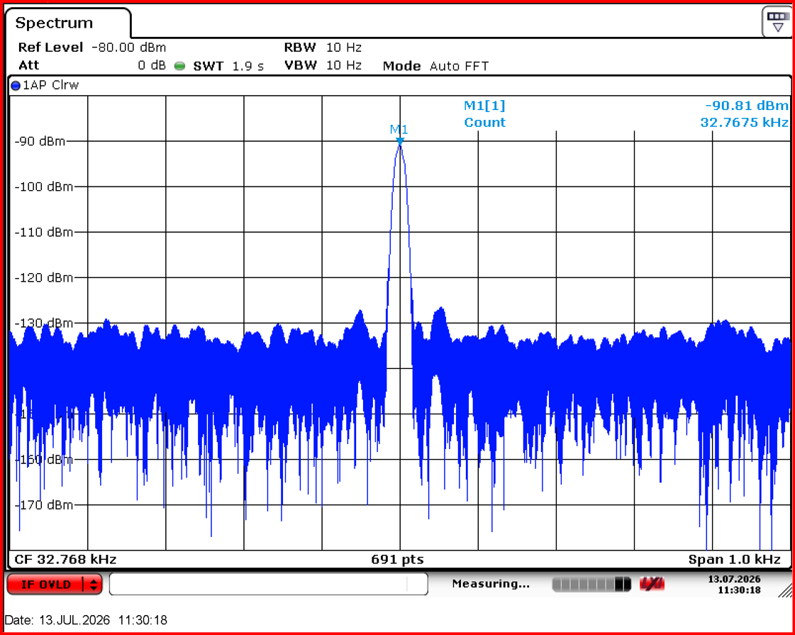
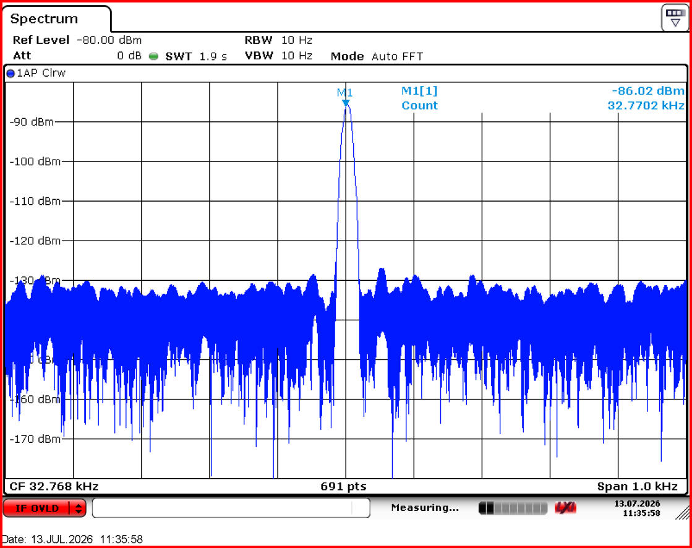
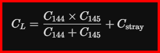

# BQ32000 RTC Osilatör Frekans Sapması ve PCB Layout Analiz Raporu

Bu repository, donanım tasarımındaki **Texas Instruments BQ32000** RTC entegresi ve **32.768 kHz kristal osilatör** devresinde meydana gelen frekans kaymalarının teknik analizini, matematiksel hesaplamalarını ve gelecekteki PCB revizyonları için layout çözüm önerilerini içermektedir.

---
Bu rapor, RTC devresinde gözlemlenen frekans sapmasını incelemektedir. Spektrum analizör ölçümleri; harici yük kapasitörleri tamamen sökülmüş olmasına rağmen, osilatörün nominal hedef frekansın (32.768kHz) altında kaldığını göstermektedir. 

Bu durum, mevcut PCB tasarımında çok yüksek bir **parazitik kaçak kapasite (Cstray)** olduğunu kesin olarak kanıtlamaktadır.

--

Ölçümler, maksimum hassasiyet sağlamak amacıyla **Rohde & Schwarz FSV Sinyal Analizörü (10 Hz – 7 GHz)** ve 10Hz Çözünürlük Bant Genişliği (RBW) kullanılarak gerçekleştirilmiştir.

* 
* 

A) **Aktif Mod (VCC​=3.3V),32.7674 kHz,32.7680 kHz,−0.6 Hz,−18.31 PPM
B) **Shutdown Modu (VBAT​=3.0V),32.7702 kHz,32.7680 kHz,+2.2 Hz,+67.14 PPM

---

### 3.1 Osilatör Yük Kapasitesi Formülü
Bir kristal osilatörün rezonans frekansı, doğrudan maruz kaldığı toplam eşdeğer yük kapasitesi (CL) tarafından belirlenir:

Burada:
* C144 x C145: Şemadaki harici SMD yük kapasitörleridir (İlk tasarımda 12pF).
* Cstray: PCB yolları, padler ve entegre pinleri tarafından üretilen parazitik kaçak kapasitedir.

### 3.2 Kök Neden Analizi
$C144 ve C145 kapasitörleri söküldüğünde 0pF , formül CL = Cstray haline gelir. 

Kristal frekansı ile "CL" ters orantılıdır (Yük kapasitesi arttıkça frekans aşağı çekilir). Kapasitörler yokken bile frekansın 32.768kHz üzerine çıkamaması, Cstray değerinin tek başına kristalin ihtiyaç duyduğu nominal yük kapasitesinden bile daha büyük olduğunu** gösterir. Şemadaki 12pF kapasitörler eklendiğinde ise frekans daha da düşerek zaman sapmasını büyütecektir.

### 3.3 Shutdown Modundaki Sapmanın VCC Hatlarıyla İlişkisi
Cihaz shutdown moduna geçtiğinde frekansın aniden 32.7702kHz (+67.14 PPM) seviyesine fırlamasının nedeni doğrudan VCC hattının kesilmesiyle ilgilidir:
1. **İç Empedans ve Kapasite Değişimi:** Aktif modda VCC 3.3V devredeyken, BQ32000'in OSCI ve OSCO pinlerindeki dahili transistörler iletimdedir ve belirli bir iç kapasite üretir. Ana güç kesilip sistem V_BACK pini üzerinden pille beslendiğinde, entegre shutdown mimarisine geçer ve bu dahili transistörler yalıtıma (kesime) uğrar. Bu durum pindeki iç kapasiteyi **aniden düşürür**. Kapasite azaldığı için frekans yukarı fırlar.
2. **Voltaj Hassasiyeti:** Osilatör devreleri besleme voltajına karşı hassastır. VCC hattının 3.3v regüleli seviyesinden, batrayanın 3.0v seviyesine gerilemesi osilatörün çalışma noktasını (bias noktasını) kaydırarak kristali daha yüksek bir frekansta salınıma zorlar.

---

## 4. Uzun Vadeli Zaman Sapması Projeksiyonları

Zaman sapması, Parts Per Million (PPM) hatası üzerinden aşağıdaki formülle hesaplanmıştır:

### 4.1 Durum A: Aktif Mod (-18.31 PPM / -0.6 Hz)
Cihaz ana güçte (VCC) çalışırken saat geri kalır:
* **Günde: 1.58 saniye (Geri kalma)
* **Ayda (30 Gün): 47.45 saniye (Geri kalma)
* **Yılda (365 Gün): 577.31 saniye ( 9.62 dakika geri kalma)

### 4.2 Durum B: Shutdown Modu (+67.14 PPM / +2.2 Hz)
Cihaz kapalıyken ve yedek pille VBAT beslenirken saat hızla ileri gider:
* **Günde: 5.80 saniye (İleri gitme)
* **Ayda (30 Gün): 174.02 saniye (2.90 dakika ileri gitme)
* **Yılda (365 Gün): 2117.25 saniye ( 35.28 dakika ileri gitme)

---

## 5. Önerilen Teknik Çözümler

### Zorunlu PCB Layout Değişiklikleri (Yeni Donanım Revizyonu)
Parazitik Cstray kapasitesini fiziksel olarak düşürmek ve donanımı stabil kılmak için layout ekibinin şu kuralları uygulaması gerekir:

1. **Bakır Boşaltma Alanları (Copper Keepout):** Kristal komponentinin, `OSCI`/`OSCO` yollarının ve yük kapasitör padlerinin altında kalan tüm iç katmanlardaki ve alt katmandaki (Layer 2, 3, 4) GND ve Güç (Power) düzlemleri tamamen boşaltılmalıdır (Keepout uygulanmalıdır). Bu, paralel plaka kapasitör etkisini yok eder.
2. **Yol Geometrisinin Optimizasyonu:** `OSCI` ve `OSCO` yolları mümkün olan en minimum genişlikte 0.15mm - 0.2mm çizilmeli ve toplam yol uzunluğu $5\text{ mm}$'nin altında tutulmalıdır.
3. **Test Noktalarının Kaldırılması:** Test pinleri yüksek empedanslı kristal hatlarından tamamen kaldırılmalıdır. 
